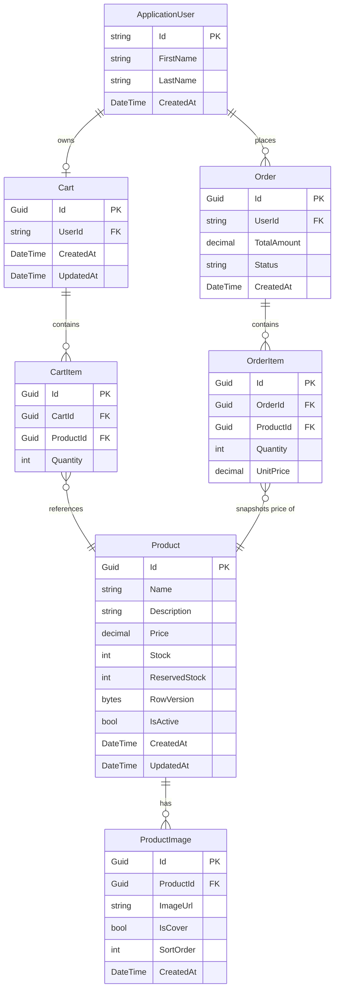

# Entity Relationships

本文件說明 `OrderSystem.Domain/Entities/` 中所有領域實體的欄位定義、關聯與重要設計決策。

---

## 實體說明

### ApplicationUser

繼承自 ASP.NET Core Identity 的 `IdentityUser`。

| 欄位      | 型別                    | 說明                               |
|-----------|-------------------------|------------------------------------|
| Id        | string (繼承)           | Primary key（GUID 字串）           |
| FirstName | string                  | 名字                               |
| LastName  | string                  | 姓氏                               |
| CreatedAt | DateTime                | 帳號建立時間 (UTC)                 |
| Orders    | ICollection\<Order\>   | 該使用者的所有訂單（一對多）       |
| Cart      | Cart?                   | 該使用者的購物車（一對一，可為空） |

---

### Cart

| 欄位      | 型別                      | 說明                         |
|-----------|---------------------------|------------------------------|
| Id        | Guid                      | Primary key                  |
| UserId    | string                    | FK → ApplicationUser.Id      |
| User      | ApplicationUser           | 導覽屬性：擁有者             |
| CartItems | ICollection\<CartItem\>  | 購物車項目（一對多）         |
| CreatedAt | DateTime                  | 建立時間 (UTC)               |
| UpdatedAt | DateTime                  | 最後更新時間 (UTC)           |

---

### CartItem

| 欄位      | 型別     | 說明                     |
|-----------|----------|--------------------------|
| Id        | Guid     | Primary key              |
| CartId    | Guid     | FK → Cart.Id             |
| Cart      | Cart     | 導覽屬性：所屬購物車     |
| ProductId | Guid     | FK → Product.Id          |
| Product   | Product  | 導覽屬性：對應商品       |
| Quantity  | int      | 加入數量                 |

---

### Order

| 欄位        | 型別                      | 說明                                   |
|-------------|---------------------------|----------------------------------------|
| Id          | Guid                      | Primary key                            |
| UserId      | string                    | FK → ApplicationUser.Id                |
| User        | ApplicationUser           | 導覽屬性：下單使用者                   |
| TotalAmount | decimal                   | 訂單總金額                             |
| Status      | OrderStatus (enum)        | 訂單狀態（Pending / Confirmed / …）   |
| CreatedAt   | DateTime                  | 訂單建立時間 (UTC)                     |
| OrderItems  | ICollection\<OrderItem\> | 訂單明細（一對多）                     |

---

### OrderItem

| 欄位      | 型別     | 說明                                         |
|-----------|----------|----------------------------------------------|
| Id        | Guid     | Primary key                                  |
| OrderId   | Guid     | FK → Order.Id                                |
| Order     | Order    | 導覽屬性：所屬訂單                           |
| ProductId | Guid     | FK → Product.Id                              |
| Product   | Product  | 導覽屬性：對應商品                           |
| Quantity  | int      | 購買數量                                     |
| UnitPrice | decimal  | 下單當時的單價快照（見設計備注）             |

---

### Product

| 欄位          | 型別                        | 說明                                             |
|---------------|-----------------------------|--------------------------------------------------|
| Id            | Guid                        | Primary key                                      |
| Name          | string                      | 商品名稱                                         |
| Description   | string                      | 商品描述                                         |
| Price         | decimal                     | 現售價格                                         |
| Stock         | int                         | 實際庫存數量                                     |
| ReservedStock | int                         | 已保留庫存（Pending 訂單佔用，見設計備注）       |
| RowVersion    | byte[]                      | 樂觀並發控制版本戳記（見設計備注）               |
| IsActive      | bool                        | 是否上架（預設 true）                            |
| CreatedAt     | DateTime                    | 建立時間 (UTC)                                   |
| UpdatedAt     | DateTime                    | 最後更新時間 (UTC)                               |
| Images        | ICollection\<ProductImage\>| 商品圖片（一對多）                              |

---

### ProductImage

| 欄位      | 型別     | 說明                                 |
|-----------|----------|--------------------------------------|
| Id        | Guid     | Primary key（預設 `Guid.NewGuid()`） |
| ProductId | Guid     | FK → Product.Id                      |
| ImageUrl  | string   | 圖片網址                             |
| IsCover   | bool     | 是否為封面主圖（預設 false）         |
| SortOrder | int      | 排列順序（數字越小越前面，預設 0）   |
| CreatedAt | DateTime | 圖片上傳時間 (UTC)                   |
| Product   | Product  | 導覽屬性：所屬商品                   |

---

## 關聯一覽

| 關聯                    | 類型  | 說明                                                     |
|-------------------------|-------|----------------------------------------------------------|
| ApplicationUser → Order | 1 : N | 一個使用者可擁有多筆訂單                                 |
| ApplicationUser → Cart  | 1 : 1 | 一個使用者對應一個購物車（Cart.UserId UNIQUE）           |
| Cart → CartItem         | 1 : N | 一個購物車可包含多個項目                                 |
| CartItem → Product      | N : 1 | 多個購物車項目可指向同一商品                             |
| Order → OrderItem       | 1 : N | 一筆訂單包含多個明細                                     |
| OrderItem → Product     | N : 1 | 多個訂單明細可指向同一商品（各自保留下單時的價格快照）   |
| Product → ProductImage  | 1 : N | 一個商品可有多張圖片                                     |

---

## ER 圖

---

## 設計備注

### UnitPrice — 價格快照

`OrderItem.UnitPrice` 儲存**下單當下**的商品售價，而非對 `Product.Price` 的即時查詢。  
這確保商品日後改價或下架，歷史訂單的金額計算仍然正確。

### ReservedStock — 庫存保留機制

`Product.ReservedStock` 記錄目前被 **Pending（待確認）** 訂單佔用的庫存量。  
實際可售庫存 = `Stock - ReservedStock`。  
訂單確認後正式扣 `Stock`，取消後釋放 `ReservedStock`，避免超賣又不需立即鎖定庫存。

### RowVersion — 樂觀並發控制

`Product.RowVersion` 對應 SQL Server 的 `rowversion`（timestamp）欄位，由 EF Core 自動管理。  
高並發情境下（例如多人同時下單同一商品），若兩個交易同時讀取後再更新，後一個會拋出 `DbUpdateConcurrencyException`，由上層邏輯重試，保護 `Stock` / `ReservedStock` 的正確性。
